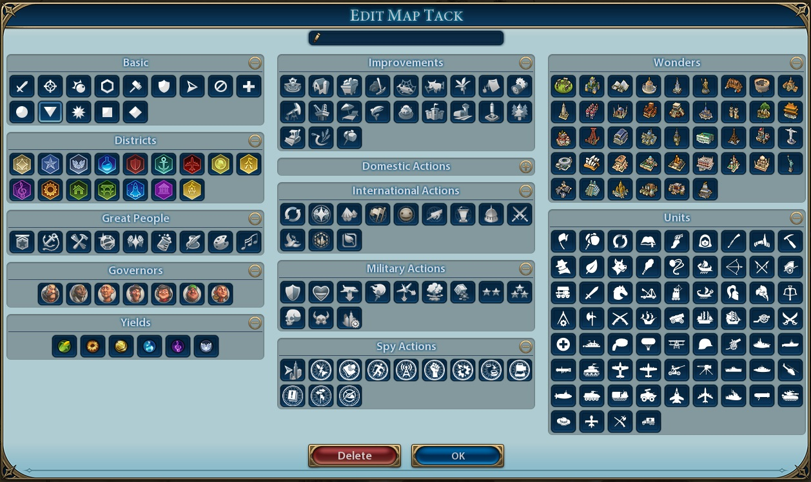
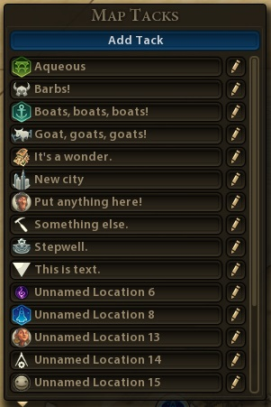
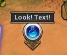

# Map Tacks Plus 1.0.1 

* Adds new map tack icons.
* Enhances list interface and world view tacks.
* Fixes bugs and styling.
* Adds quick access feature (keybinding and right-click to delete)

Based on the original Map Tacks mod by Bradd Szonye.

### Installation 
* [Steam workshop](https://steamcommunity.com/sharedfiles/filedetails/?id=1566059738) 
* [Manual install](https://github.com/FiatAccompli/Civ6Mods/releases)

You also need to install:
* [Settings Manager](https://github.com/FiatAccompli/Civ6Mods/tree/master/SettingsManager) ([Steam workshop](https://steamcommunity.com/sharedfiles/filedetails/?id=1564628360)).
* [UI Plugins Framework](https://github.com/FiatAccompli/Civ6Mods/tree/master/UIPluginsFramework) ([Steam workshop](https://steamcommunity.com/sharedfiles/filedetails/?id=1632664596)).

## Features

### New icons
Numerous new icons added to the map tack editor.  All nicely categorized and 
allows you to hide the categories you don't want.

* Districts, customized with civilization unique districts
* Improvements, including unique & bonus improvements from civilization
  abilities, city states, and governors.
* Unit actions like harvesting, repair, archaeology, and espionage
* Great people
* Wonders
* Units
* Governors
* Random other icons

For improvements and units there are configuration settings for which civ/leader 
uniques are shown.  You can show uniques only from your own civilization, 
from civs you have met, from all civs in game, or from all civs (in-game or not).

### Usability improvements
* Keybinding for adding/editing a map tack (U by default).
* Right-click to delete a tack (works on both the world-view tack and in tack list).

All new icons have tooltips, with game effects for districts and improvements.

### Scrollable map tack list 
The list dynamically resizes to show up to 15 map tacks, with a scrollbar to
manage longer lists.  It groups all named locations at the top, followed by all
unnamed locations in numerical order.

### Bug fixes and restyling
The mod fixes a few base-game bugs and styling problems.  It handles large
numbers of map tacks without breaking the popup list or causing performance
problems.  Unnamed markers now sort correctly when there are more than ten.
Labels and controls have more consistent alignment and spacing.  The mod
improves overlapping and stacked icons, so that closer tacks always look
closer, and the current player always appears on top in multiplayer.

### Improved pin look

The text associated with a tack is now "signposted" rather than floating randomly
above the pin making it easy to read regardless of world background.

### Compatibility
The Map Tacks Plus mod does not affect saved games, so you can add it to a game in
progress or disable it without breaking your game.  In general it should override 
map pin features in other UI mods, but as with any civ 6 mods, if multiple active mods 
are touching the same files you're asking for trouble.  Map Tacks Plus is compatible
with Unique District Icons and uses the unique icons for districts as well as mods that 
add new civilizations/districts/units.

### Version History 
* 103 - Added default automatic pin naming based on icon (a few icons do not have 
  a default pin name because there's no good existing texts in the game and I'm not 
  interested enough to write new ones.)
* 102 - Added icons for Gathering Storm environmental effects - volcanoes, flooding, etc.
  Added Gathering Storm spy mission icons.  Increased default height of popup so it looks 
  better in Gathering Storm (with the caveat that on the smallest screen sizes the popup now
  slightly exceeds the screen size which looks a bit funny).
* 101 - Updated for Gathering Storm release.  Changed key binding behavior so it is now 
  push key then select hex with mouse rather than push key to select current hex the mouse
  is over.  I realize this is slightly less convenient, but it meshes better with another
  mod I have in the works.
